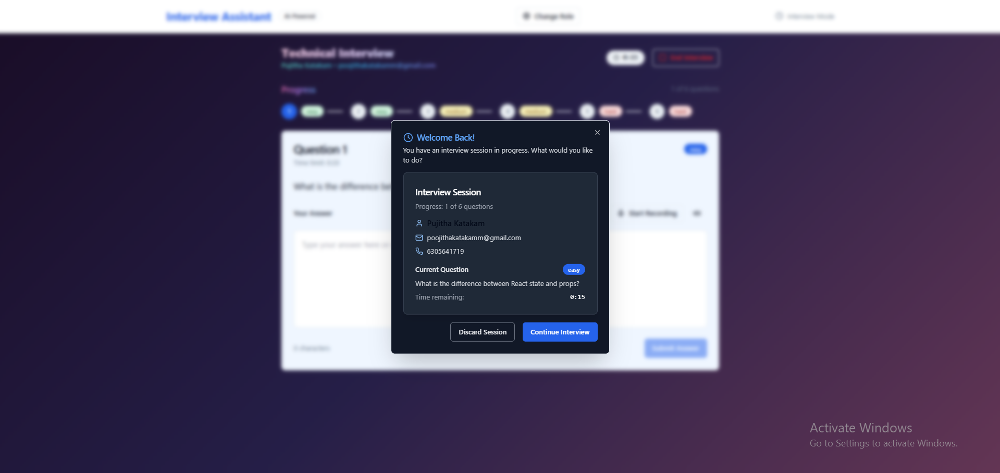

<<<<<<< HEAD
# 🤖 AI-Powered Interview Assistant – Swipe

A full-stack **Interview Assistant Web App** that streamlines resume parsing, candidate interview, feedback, interviewer page with all candidates data and scores..  
Built with **React + Vite + Redux + TailwindCSS** for the frontend and a **Python backend**, it helps recruiters and candidates manage interviews efficiently with automated scoring and feedback.

---

## 🚀 Features
- 📂 **Resume Upload & Parsing** – Extracts key information from PDF/DOCX resumes   
- 📝 **Interactive Assessments** – Timed questions with real-time scoring  
- 📊 **Feedback & Insights** – Provides AI-powered evaluation for candidates  
- 💾 **Persistent State** – Saves progress with Redux-Persist  
- 🎨 **Modern UI** – Responsive design using TailwindCSS & Radix UI components  

---

## 🛠️ Tech Stack
| Layer       | Technologies Used                       |
|-------------|-----------------------------------------|
| Frontend    | React, Vite, Redux Toolkit, TailwindCSS, Radix UI |
| Backend     | Python (`Assistant.py`), FastAPI/Flask *(as configured)* |
| Build Tools | Vite, ESLint, PostCSS                    |
| Deployment  | Works cross-platform with `install.sh` / `start.sh` |

---

## 📦 Installation

### 1. Clone the Repository
```bash
git clone https://github.com/pujitha-katakam/-AI-Powered-Interview-Assistant-Crisp-.git
cd AI-Powered-Interview-Assistant-Crisp-

2. Install Frontend Dependencies
npm install

3. (Optional) Install Backend Dependencies
pip install -r requirements.txt

**▶️ Running the Application**
##Start Frontend (Vite Dev Server)
npm run dev
**Start Backend (Python)**
npm run dev:backend
**Start Both Together**
npm run dev:full


## 📁 Project Structure

Swipe/
├─ .eslintrc.cjs                  # ESLint configuration
├─ .gitignore                     # Ignored files for Git
├─ Assistant.py                   # Python backend entry point
├─ FINAL_STATUS.md                # Status documentation
├─ README.md                       # Project documentation
├─ SETUP_GUIDE.md                  # Setup instructions
├─ STATUS_REPORT.md                # Progress report
├─ constants.py                    # Python constants file
├─ env.example                      # Example environment variables
├─ index.html                       # Main HTML file for Vite
├─ install.sh                        # Installation script (Linux/Mac)
├─ install.bat                        # Installation script (Windows)
├─ package.json                        # Frontend dependencies & scripts
├─ package-lock.json                    # Dependency lock file
├─ postcss.config.js                     # PostCSS configuration
├─ requirements.txt                        # Python backend dependencies
├─ requirements-dev.txt                      # Development Python dependencies
├─ start.sh                                   # Startup script (Linux/Mac)
├─ start.bat                                   # Startup script (Windows)
├─ tailwind.config.js                            # TailwindCSS configuration
├─ tsconfig.json                                  # TypeScript configuration
├─ tsconfig.node.json                             # TypeScript config for Node
├─ vite.config.ts                                  # Vite build configuration
├─ test_resume.docx                                 # Sample resume for testing
│
├─ dist/                                            # Production build output
│
├─ src/                                             # Frontend source code
│  ├─ assets/                                       # Images, icons, static files
│  ├─ components/                                   # Reusable React components
│  ├─ pages/                                        # Page-level React components
│  ├─ store/                                        # Redux store & slices
│  ├─ services/                                     # API and utility functions
│  ├─ App.tsx                                       # Main React App component
│  ├─ main.tsx                                      # App entry file
│  └─ ...                                           # Other frontend utilities
│
└─ node_modules/                                    # Installed frontend dependencies


## Screenshots





🤝 Contributing

Contributions, issues, and feature requests are welcome!
Feel free to fork the project and submit pull requests.

📄 License

This project is licensed under the MIT License.
You’re free to use, modify, and distribute it with proper attribution.

⭐ Acknowledgments

Special thanks to open-source libraries and contributors that power this project.
✅ Now your README reflects the **correct port (`3000`)** for running your project locally.


---

## 🙏 Thank You!


=======
<<<<<<< HEAD
# AI-Powered-Interview-Assistant-Crisp-
AI-Powered Interview Assistant is a full-stack Interview Assistant that streamlines resume parsing. Built with React, Vite, Redux, and a Python backend, it delivers a fast, modern, and responsive experience. Ideal for recruiters and candidates to manage interviews efficiently with scoring, feedback, and smooth UI.
=======
# Interview Assistant

A comprehensive AI-powered interview assistant system with both frontend and backend components.

## Features

- **Dual Interface**: Separate tabs for Interviewees and Interviewers
- **Resume Parsing**: Upload PDF/DOCX resumes with AI-powered field extraction
- **Interview Flow**: Timed questions with automatic progression
- **Real-time Scoring**: AI-powered answer evaluation using OpenAI
- **Dashboard**: Comprehensive candidate management and analytics
- **Offline Support**: Works without backend connection
- **Persistent Storage**: Sessions survive page refreshes
- **Cross-platform**: Runs on Windows, macOS, and Linux

## Tech Stack

### Frontend
- **React 18** + TypeScript + Vite
- **State Management**: Redux Toolkit + Redux Persist
- **Storage**: LocalForage (IndexedDB)
- **UI Components**: shadcn/ui + Tailwind CSS
- **File Parsing**: pdfjs-dist + mammoth (client-side fallback)
- **Routing**: React Router v6
- **HTTP Client**: Axios

### Backend
- **FastAPI** with Python 3.8+
- **OpenAI API** integration for AI features
- **File Processing**: PDF/DOCX parsing
- **CORS** enabled for frontend integration
- **Async/Await** for high performance

## Quick Start

### Option 1: Automated Setup (Recommended)

**Windows:**
```bash
# Run the installation script
install.bat

# Start the application
start.bat
```

**Linux/macOS:**
```bash
# Make scripts executable and run
chmod +x install.sh start.sh
./install.sh
./start.sh
```

### Option 2: Manual Setup

#### Prerequisites
- **Python 3.8+** with pip
- **Node.js 16+** with npm
- **OpenAI API Key** (optional but recommended)

#### Backend Setup
```bash
# Install Python dependencies
pip install -r requirements.txt

# Configure environment
cp env.example .env
# Edit .env and add your OpenAI API key

# Start backend
python Assistant.py
```

#### Frontend Setup
```bash
# Install Node.js dependencies
npm install

# Start frontend
npm run dev
```

## Installation Details

### Python Dependencies (`requirements.txt`)
- **FastAPI**: Modern web framework
- **Uvicorn**: ASGI server
- **OpenAI**: AI integration
- **PDF/DOCX parsing**: Resume processing
- **Cross-platform compatibility**: Works on all systems

### Node.js Dependencies (`package.json`)
- **React 18**: Frontend framework
- **TypeScript**: Type safety
- **Vite**: Build tool and dev server
- **Redux Toolkit**: State management
- **Tailwind CSS**: Styling
- **File processing**: Client-side parsing

## Configuration

### Backend Configuration (`constants.py`)
```python
OPENAI_API_KEY = "your-openai-api-key-here"
APP_HOST = "0.0.0.0"  # Change to "127.0.0.1" for localhost only
APP_PORT = 8000
```

### Frontend Configuration (`.env`)
```env
VITE_API_URL=http://localhost:8000
VITE_OPENAI_API_KEY=your-openai-api-key-here
```

## Development

### Available Scripts

**Backend:**
```bash
python Assistant.py              # Start development server
pip install -r requirements-dev.txt  # Install dev dependencies
```

**Frontend:**
```bash
npm run dev          # Start development server
npm run build        # Build for production
npm run preview      # Preview production build
npm run lint         # Run ESLint
```

**Full Stack:**
```bash
npm run dev:full     # Start both frontend and backend
```

## Production Deployment

### Backend
```bash
# Install production dependencies
pip install gunicorn

# Run with Gunicorn
gunicorn -w 4 -k uvicorn.workers.UvicornWorker Assistant:app --bind 0.0.0.0:8000
```

### Frontend
```bash
# Build for production
npm run build

# Serve static files (nginx, Apache, etc.)
# Files will be in the 'dist' directory
```

## API Endpoints

The backend provides these endpoints:
- `GET /` - Health check
- `GET /health` - Detailed health status
- `POST /parse-resume` - Parse uploaded resume files
- `POST /generate-questions` - Generate interview questions
- `POST /score-answer` - Score candidate answers
- `POST /finalize` - Generate final interview summary
- `POST /test-openai` - Test OpenAI API connection

## Troubleshooting

### Common Issues

1. **Python Dependencies**: Use `pip install --user -r requirements.txt` if permission errors
2. **Node.js Dependencies**: Clear cache with `npm cache clean --force`
3. **Port Conflicts**: Change ports in `constants.py` and `.env`
4. **OpenAI API**: Ensure valid API key with sufficient credits
5. **File Upload**: Check file format (PDF/DOCX) and size (max 10MB)

### Platform-Specific Notes

- **Windows**: Use PowerShell as Administrator if needed
- **macOS**: Install Xcode Command Line Tools: `xcode-select --install`
- **Linux**: Install build essentials: `sudo apt-get install build-essential`

## File Structure
```
Swipe/
├── Assistant.py              # FastAPI backend
├── constants.py              # Backend configuration
├── requirements.txt          # Python dependencies
├── requirements-dev.txt      # Development dependencies
├── package.json              # Node.js dependencies
├── src/                      # React frontend
├── dist/                     # Built frontend files
├── install.sh               # Linux/macOS setup script
├── install.bat              # Windows setup script
├── start.sh                 # Linux/macOS start script
├── start.bat                # Windows start script
├── SETUP_GUIDE.md           # Detailed setup guide
└── README.md                # This file
```

### Building for Production

```bash
npm run build
```

## Project Structure

```
src/
├── components/          # React components
│   ├── ui/             # shadcn/ui components
│   ├── IntervieweeTab.tsx
│   ├── InterviewerTab.tsx
│   ├── ResumeUploader.tsx
│   └── ...
├── store/              # Redux store and slices
│   ├── slices/        # Redux slices
│   └── index.ts
├── services/           # API and utility services
├── hooks/             # Custom React hooks
├── types/             # TypeScript type definitions
└── lib/               # Utility functions
```

## Key Components

### Interviewee Tab
- **ResumeUploader**: Handles PDF/DOCX upload and parsing
- **Interview Flow**: Question display with timers
- **Progress Tracking**: Visual progress through questions
- **Results Display**: Final score and AI summary

### Interviewer Tab
- **Candidates Table**: Sortable list of all candidates
- **Search & Filter**: Find candidates by name/email
- **Candidate Details**: Full interview transcript and scores
- **Analytics**: Statistics and performance metrics

## State Management

The app uses Redux Toolkit with the following slices:

- **session**: Active interview state, timers, progress
- **candidates**: Candidate profiles and results
- **ui**: Modals, toasts, UI state
- **config**: App configuration and settings

## Offline Support

The app includes comprehensive offline support:

- **Client-side file parsing** when backend is unavailable
- **Mock AI responses** for question generation and scoring
- **Local storage** for interview sessions
- **Graceful degradation** with user notifications

## API Integration

The frontend integrates with the FastAPI backend through:

- **Resume parsing** (`/parse-resume`)
- **Question generation** (`/generate-questions`)
- **Answer scoring** (`/score-answer`)
- **Interview finalization** (`/finalize`)

## Error Handling

- **Network errors**: Automatic retry and fallback
- **File parsing errors**: User-friendly error messages
- **Validation errors**: Inline form validation
- **Offline detection**: Automatic offline mode activation

## Development

### Available Scripts

- `npm run dev` - Start development server
- `npm run build` - Build for production
- `npm run preview` - Preview production build
- `npm run lint` - Run ESLint

### Code Style

- TypeScript strict mode enabled
- ESLint + Prettier for code formatting
- Component-based architecture
- Custom hooks for reusable logic

## Deployment

The app can be deployed to any static hosting service:

1. Build the project: `npm run build`
2. Deploy the `dist` folder to your hosting service
3. Configure environment variables
4. Ensure backend API is accessible

## Browser Support

- Chrome 90+
- Firefox 88+
- Safari 14+
- Edge 90+

## Contributing

1. Fork the repository
2. Create a feature branch
3. Make your changes
4. Add tests if applicable
5. Submit a pull request

## License

MIT License - see LICENSE file for details
>>>>>>> d33bfa0 (Initial commit)
>>>>>>> 70196f5 (Initial commit)
